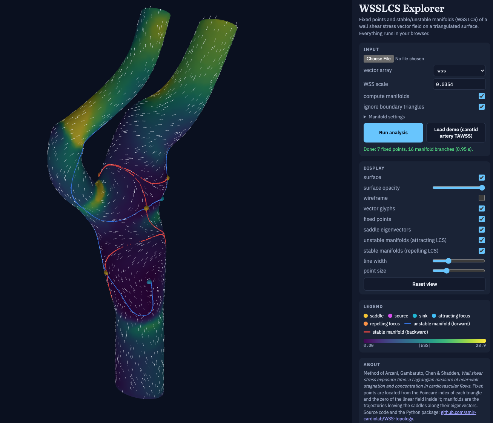

# WSSLCS Explorer

Fixed points and stable/unstable manifolds (WSS Lagrangian coherent
structures) of a wall shear stress (WSS) vector field on a triangulated
surface, computed entirely in the browser.

**Live app: https://amir-cardiolab.github.io/WSS-topology/**

*The WSS LCS Explorer: fixed points (spheres, coloured by type) and the
unstable (blue) and stable (red) manifolds of a WSS field on a carotid artery
model, computed in the browser.*

Open the page, load a surface file with a point vector array (or use the
demo data set that loads automatically), and explore the WSS topology:

* **fixed points** of the WSS field: sources, sinks, saddles, foci and
  centers, located from the Poincaré index of every triangle and the zero of
  the linear field inside it, with the eigenvalues/eigenvectors of the local
  Jacobian;
* **stable and unstable manifolds** of the saddles: the WSS trajectories
  leaving each saddle along its eigenvectors, integrated forward (unstable
  manifold, attracting WSS LCS, blue) and backward (stable manifold, repelling
  WSS LCS, red) until they reach another fixed point or leave the surface.

Results can be downloaded as legacy ASCII VTK files (readable by ParaView),
CSV and JSON.  Nothing is uploaded: the file is parsed and processed by
JavaScript in your browser.

## Input files

* legacy `.vtk` (ASCII or binary, PolyData or UnstructuredGrid, old and
  VTK 5.1 cell layouts);
* XML `.vtp` / `.vtu` (ascii, inline base64, appended raw or base64 data,
  optionally zlib-compressed).

The surface must be triangulated (quads/polygons are fan-triangulated) and
carry a 3-component point array with the WSS vectors (cell vectors are
averaged to the points).  Any array can be selected from the drop-down.

## Method and references

The tool implements the WSS topology analysis developed in the following
papers.  Please cite them if you use it:

1. Arzani, A., Gambaruto, A. M., Chen, G. and Shadden, S. C., *Wall shear
   stress exposure time: A Lagrangian measure of near-wall stagnation and
   concentration in cardiovascular flows*, Biomechanics and Modeling in
   Mechanobiology, 16(3), 787–803, 2017.
2. Arzani, A., Shadden, S. C., *Wall shear stress fixed points in
   cardiovascular fluid mechanics*, Journal of Biomechanics, 73, 145–152,
   2018.
3. Arzani, A., Gambaruto, A. M., Chen, G. and Shadden, S. C., *Lagrangian
   wall shear stress structures and near wall transport in high Schmidt
   aneurysmal flows*, Journal of Fluid Mechanics, 790, 158–172, 2016.

The stable and unstable manifolds of the WSS fixed points are the WSS
Lagrangian coherent structures (WSS LCS) introduced in [3], which organize
near-wall transport: near-wall trajectories accumulate along the unstable
manifolds (attracting WSS LCS) and separate along the stable manifolds
(repelling WSS LCS).  Reference [2] discusses the WSS fixed points themselves
(sources, sinks, saddles, foci) and their significance in cardiovascular
flows.  Reference [1] describes the computation used here (Section 2.4):
the fixed points of the (time-averaged) WSS vector field are located in the
triangles whose Poincaré index is non-trivial, the field is linearised
around them to obtain the Jacobian, its eigenvalues and eigenvectors, and
the saddle-type fixed points are perturbed along the eigenvector of the
positive (negative) eigenvalue and integrated forward (backward) in time to
trace the unstable (stable) manifold, until the trajectory reaches another
fixed point or leaves the domain.  Reference [1] also defines the WSS
exposure time, which is computed by the desktop Python version of this
software.

Implementation notes: vertex vectors are projected onto the tangent planes,
transported into the triangles with the discrete polar map of the vertex
fans, and interpolated linearly inside each triangle; manifolds are traced
with RK4 in arc length across the triangles (exact edge crossings, vertex
handling).  This page is the browser version of the Python/VTK package
WSSLCS, which also computes WSS trajectories, residence time and WSS
exposure time.

## Files

| file | content |
|---|---|
| `index.html` | the page (three.js rendering, controls, tables, exports) |
| `wsslcs-core.js` | mesh, field transport, fixed points, manifolds, tracer |
| `vtk-reader.js` | VTK legacy / XML reader |
| `worker.js` | runs the analysis in a Web Worker |
| `docs/WSSLCS_explorer.png` | screenshot used in this README |
| `demo/Carotid_artery_TAWSS.vtk` | demo data: time-averaged WSS on a carotid artery surface (22 899 points, 45 794 triangles, 7 fixed points) |

The site is static: any web server (or GitHub Pages) can host these files.
three.js is loaded from the jsDelivr CDN and the fonts from Google Fonts.
